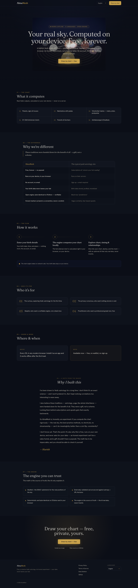

# AlmaMesh

**A free, offline, local-first Vedic astrology app that runs entirely in your
browser.** Give it a birth date, time, and place; it computes a full sidereal
chart — planets, signs, houses, nakshatras, and Vimshottari dasha periods —
on your own device, in a tab. You get **degree-accurate North- and South-Indian
kundli charts**, a **live 3D planetary force-field** of the sky at your birth
moment, and **optional AI interpretation and chat** (bring your own
OpenAI-compatible model — a one-click OpenRouter preset or a local endpoint).
No account, no server, no data harvesting; the chart engine itself runs entirely
on your device. Install it as a PWA and it works offline after the first load.

**▶ Try it live: [almamesh.com](https://almamesh.com)** — no install, no sign-up.



- **What it is:** an installable web app whose chart engine is the *unchanged*
  Python `almamesh` package compiled to WebAssembly via **Pyodide** and run in a
  Web Worker. The chart you see in the browser is **byte-identical** to the one
  CPython computes.
- **Why it works offline:** a **signed, content-addressed bundle** (the DE421
  ephemeris + the Skyfield/Pyodide wheels + the `almamesh` wheel + provenance
  metadata) is synced into the browser's OPFS once. After that, every chart is
  pure on-device compute — no cloud call is ever needed to draw a chart.
- **Why it exists:** astrology apps are riddled with paywalls, account walls, and
  quiet data harvesting. AlmaMesh is the opposite — auditable, gratis, private by
  construction, and the same on every OS because it's just a browser tab. The
  "Observatory" UI ships self-hosted fonts (no font CDN), so a freshly loaded
  app makes **zero cross-origin requests** to draw a chart.
- **Why it's a *mesh*:** the people close to you are part of your sky too. Add
  them as profiles and AlmaMesh reads the **relationship between two whole
  charts** — classical compatibility (Guna Milan) for partners, the planetary
  conversation between any two people, and the times your life-chapters overlap.
  Every relationship is computed on *your* device from two finished charts;
  neither chart is ever changed by the other.
- **Status:** **shipped and tested.** The in-browser engine, the North/South
  charts, the **D9 Navamsa** divisional chart, the 3D force-field, the offline
  client-side geocoder, named profiles (create / rename / delete), gated
  **PDF export**, optional AI interpretation + chat, the **mesh** (relationship
  readings between people) and the **Sky & Timing** predictive layer, and
  PWA/offline delivery all work today — see [Status](#status). There is **no
  backend**: the Python side is a build-time bundle publisher plus the engine.

## What you get

- **North + South Indian charts** — degree-accurate `SVG` kundli rendered off a
  pure `@almamesh/store` geometry adapter (`buildChartGeometry(SiderealChart)`);
  toggle styles with `ChartStyleToggle`, read placements in the planetary table.
- **3D planetary force-field** — a `three.js` hero (`apps/web/src/components/forcefield/`)
  that places each graha at its real ecliptic longitude from a pure
  `buildEnergyFrame(SiderealChart, t)` adapter, with 2D⇄3D cross-highlighting.
- **AI interpretation + multi-turn chat** — `@almamesh/llm` talks to any
  **OpenAI-compatible endpoint** (a one-click **OpenRouter** preset for a hosted
  model, or a local **Ollama**-style endpoint you bring yourself). One model
  powers *both* the interpretation and the follow-up chat; your API key lives
  only in the browser and is never bundled. The chart is **PII-redacted** before
  the prompt, and `local_only` is **fail-closed** (a cloud host is refused under
  the privacy gate). AI is **never required to draw a chart**. (An in-browser
  WebLLM engine ships dormant in the tree — disabled in this build, kept for a
  future re-enable.)
- **D9 Navamsa divisional chart** — the engine computes the Navamsa (D9) and it
  renders alongside the rasi (D1) in both kundli styles (and in the print report).
  Reshaped by the same pure store adapter; the astrology stays in Python.
- **The mesh — relationship readings between people** — the namesake feature.
  Add the people close to you (each gets a full chart of their own) and open the
  **`/mesh` constellation**; click any thread for a side-by-side read of two
  whole charts. **Partner edges** show the classical 36-point **Ashtakoota Guna
  Milan** and **Mangal (Kuja) dosha** screening (cited tables, fear-free); every
  edge shows the two-way chart overlay, the **daśā windows where both lives
  turn at once**, and the shared house/kāraka significators. The compatibility
  band is labeled a *classical convention, never a verdict*, the AI narration is
  role-anonymized (you and "your spouse", never a name), and the engine's
  read-only promise — relations are read *from* two finished charts and change
  neither — is printed at the foot of every edge.
- **"Sky & Timing" predictive layer** — a second on-device engine pass computes
  current transits (Gochara) + Sade Sati, dasha depth (antar/pratyantar), the full
  D1–D60 divisional-chart set, Ashtakavarga + Shadbala planetary strength, and
  per-life-domain forecasts (career, finances, health, relationships, …). It
  surfaces on the `/predictive` route — including a full **Periods** explorer
  (the 120-year Vimśottarī tree, drillable to antar/pratyantar) and a **Road
  Ahead** timeline — plus a dashboard timing section and report sections VI–IX,
  same zero-egress, byte-identical determinism as the natal chart.
- **Named profiles** — multiple people share one device with **no passwords**;
  each profile owns its own saved charts, switchable from the header. Profiles
  can be renamed and deleted (deleting one cascade-removes its charts).
- **Birth-time rectification** — set a rectified birth time and a confidence
  level per profile in Settings; the rectified instant recomputes the chart.
- **PDF export** — once an AI interpretation finishes, an **Export PDF** button
  prints a branded report (cover page, birth details, D1 + D9, and the full
  interpretation). It stays disabled until a real interpretation has completed,
  so the report is never empty.
- **Languages (English / Spanish / Portuguese)** — the whole UI is
  internationalized with [react-i18next](https://react.i18next.com/). Switch language in **Settings →
  Preferences → Language**; the choice is persisted and `<html lang>` follows it.
  The **optional AI also answers in the chosen language** (only the narration
  changes — the chart engine and canonical Sanskrit terms stay untouched).
  Catalogs are **bundled and service-worker precached, so it works fully offline
  with zero extra network requests** — no runtime translation fetch. English is
  authoritative; **es/pt are machine-translated** and tracked against it.

> **The chart engine is zero-egress; only AI calls leave the device.** Charts,
> geometry, the force-field, and the offline geocoder never touch the network
> after the first bundle sync. The *only* outbound requests are the optional AI
> calls you opt into — to whichever OpenAI-compatible endpoint you configure
> (OpenRouter, or a local Ollama-style endpoint that stays on your machine). The
> prompt is PII-redacted, and `local_only` fail-closes against a cloud host.

## Building from source — prerequisites

**TL;DR: this repo is self-contained — a single `git clone` builds everything.**
The three formerly-private dependencies are **vendored in-repo**, each with
provenance, license, and re-vendor policy documented in a `VENDORED.md` next to
the code:

- `backend/vendor/edge-proc` — the signed-bundle / Task-Runtime substrate (Python)
- `backend/vendor/shared-libs-python` — its transitive dependency (Python)
- `frontend/packages/edgeproc-browser` — `@edgeproc/browser`, the in-browser
  bundle-sync tier (a regular Bun workspace package)

No sibling checkouts, no private access, no tokens: `git clone`, then
`uv sync` + `bun install`, then run. CI builds from this same single checkout.

## Quickstart — generate a chart in your browser, offline

Requires [Bun](https://bun.sh/), [`uv`](https://docs.astral.sh/uv/), and
Python 3.13. Nothing else — every dependency ships in this repo.

```bash
git clone https://github.com/hseshadr/almamesh.git && cd almamesh

# One command, from the repo root. Installs deps, builds the dev assets, then
# builds and opens the app at http://localhost:4173.
uv run poe demo
```

> The first run fetches the Pyodide dist and the DE421 ephemeris once (network
> required); after that the app is fully offline. Use `uv run poe demo-fresh` to
> force-rebuild the signed dev bundle.

<details>
<summary>What <code>poe demo</code> runs under the hood (the manual steps)</summary>

```bash
# 1. Install workspace deps
cd frontend
bun install

# 2. One-time: build the dev assets the in-browser engine needs.
#    This fetches a self-hosted Pyodide dist and signs a dev edge-proc bundle
#    (DE421 + wheels + meta) into apps/web/public/ — all gitignored.
#    The script lives at frontend/apps/web/scripts/setup-dev-assets.sh.
cd apps/web
./scripts/setup-dev-assets.sh

# 3. Build and preview. IMPORTANT: the engine's module Workers only resolve in a
#    production build, NOT `vite dev` — so build first, then preview.
bun run build
bun run preview            # prints a local URL, e.g. http://localhost:4173
```

</details>

Open the previewed URL, enter a birth date/time/place (the location box is an
**offline** geocoder — no network), and generate a chart. Watch the network tab:
after the first bundle sync there are **zero** cross-origin requests, and the app
keeps working with the network disabled. That's the whole product.

> **Dev-server caveat:** `bun run dev` (`vite dev`) is fine for editing UI, but
> the dev server's ESM module Workers fail to resolve the `pyodide` import in
> worker scope, so the *engine* only runs in a real build (`vite build` +
> `vite preview`). The live exit-gate test below drives exactly that build.

### No-frontend path: a real chart in one command

Prefer the terminal? The same engine has an offline CLI — no browser, no server.

```bash
cd backend
uv sync --extra dev
uv run almamesh-chart "1990-01-15T12:00:00+00:00" 40.7128 -74.0060
```

It prints the full sidereal chart as JSON — ascendant, the nine grahas with
sign/nakshatra/pada, whole-sign houses, and the active dasha hierarchy — with no
network and no account. (`examples/run_chart.sh` wraps the same call.)

## Publish a signed bundle (build-time)

The engine's data and wheels are delivered to browsers as a **signed,
content-addressed bundle**. A device verifies an ed25519 signature against a
pinned key and **fails closed** on any tampering. Compute always stays local; the
network is delivery-only.

```bash
cd backend
uv run almamesh-bundle keygen ./keys                              # raw ed25519 keypair (0o600 private key)
uv run almamesh-bundle bundle ./origin ./keys/private.key --version v1
```

`./origin` is a static directory any web server or CDN can serve; `public.key` is
pinned into the client as the trust root. (`setup-dev-assets.sh` runs this for you
to produce the local dev bundle.)

## Architecture

```
Browser (the product) ─ installable PWA, offline after first load
│
├─ apps/web                      React + Vite + Tailwind UI
│    └─ offline geocoder         birth location with zero network (bundled cities)
│
├─ @almamesh/browser             the in-browser engine
│    ├─ edge-proc bundle sync ──▶ verifies ed25519 + sha256, materializes into OPFS
│    └─ Pyodide Web Worker  ────▶ boots the UNCHANGED almamesh wheel, computes the chart
│         │  emits SiderealChart (TS mirror of the Python SiderealContext)
│         ▼
├─ @almamesh/store               pure adapters (reshape only, no astrology):
│    ├─ SiderealChart -> ChartData          (the UI contract)
│    ├─ buildChartGeometry(SiderealChart)   (N/S kundli geometry)
│    ├─ buildEnergyFrame(SiderealChart, t)  (3D force-field frame)
│    ├─ profiles + members                  (named, password-less people; typed relationships)
│    └─ mesh                                (MeshEdgeContext per pair → the /mesh edge view)
├─ @almamesh/llm                 optional interpretation + chat: OpenRouter /
│                                BYO OpenAI-compatible endpoint by default (one
│                                shared model; WebLLM dormant); PII-redacted,
│                                fail-closed local_only; mesh narration is
│                                role-anonymized (no names leave the device)
└─ @almamesh/{shared-types,constants}   constants = single design-token source

Build-time (Python, no server)
│
└─ backend/src/almamesh/
     ├─ calculations.py          sidereal astronomy (Skyfield + DE421; Lahiri default,
     │                           True-Chitra ayanamsa + True-node selectable)
     ├─ dasha/  yogas/           Vimshottari dasha + yoga detection
     ├─ transits/  strength/     predictive: Gochara/Sade Sati, Ashtakavarga + Shadbala, vargas
     ├─ mesh/                    relationship engine: Ashtakoota Guna Milan + Mangal (cited
     │                           classical tables), chart overlay, daśā synchrony, significators
     │                           → a frozen, read-only MeshEdgeContext per pair
     └─ edge/
          ├─ chart_runtime.py    deterministic on-device chart runtime (also runs under Pyodide)
          ├─ bundle.py           signed bundle publisher + consumer
          ├─ cli.py              almamesh-chart   (offline chart, no browser)
          └─ publish_cli.py      almamesh-bundle  (keygen + sign + publish the bundle)
```

The Python entrypoint the browser calls (`calculate_sidereal_context(...,
reference_date=...)`) is the *same* one the CLI calls. The fixed `reference_date`
pins the "current" dasha, which is what makes a chart reproducible byte-for-byte
across CPython and Pyodide.

See [`frontend/README.md`](frontend/README.md) for the monorepo layout and the
full set of dev/build/test commands.

## Status

| Capability | What | State |
|------------|------|-------|
| Engine | Deterministic sidereal chart + dasha + yogas (Python); Lahiri default, True-Chitra + True-node selectable | ✅ shipped, tested |
| Engine validation | External golden-reference check: astropy (independent code path) + committed JPL Horizons cross-check, agreeing to sub-arcsecond; license-clean (no Swiss Ephemeris) | ✅ shipped, tested |
| Bundle publisher | Signed, content-addressed bundle publish/sync | ✅ shipped, tested |
| Offline CLI | `almamesh-chart`, `almamesh-bundle` | ✅ shipped, tested |
| In-browser engine | The Python wheel in Pyodide/WASM, off the UI thread | ✅ shipped (byte-parity gated) |
| N/S Indian charts | Degree-accurate SVG kundli off a pure geometry adapter | ✅ shipped |
| 3D force-field | three.js hero, planets at real ecliptic longitude | ✅ shipped |
| D9 Navamsa | Engine computes the Navamsa; renders in both kundli styles + the print report | ✅ shipped |
| Divisional charts (D1–D60) | Full Shodasavarga set; D9 also rendered as a kundli, the rest as tables | ✅ shipped |
| Predictive layer ("Sky & Timing") | Transits/Gochara + Sade Sati, dasha depth (antar/pratyantar), Ashtakavarga + Shadbala, per-life-domain forecasts; `/predictive` route (incl. a Periods explorer + Road Ahead) + report sections VI–IX | ✅ shipped |
| The mesh (relational astrology) | Per-pair relationship read of two whole charts: Ashtakoota Guna Milan + Mangal screening (cited classical tables, partner edges only), chart overlay, daśā synchrony, significators; role-anonymized AI narration, read-only by construction; `/mesh` constellation + `/mesh/:memberId` edge view | ✅ shipped |
| Members | People you add to your mesh, with typed relationships (spouse/partner/family/friend/…), each owning a full chart; persisted with a versioned migration; managed in Settings → People | ✅ shipped |
| AI interpretation + chat | OpenRouter / BYO OpenAI-compatible, one-click preset, one shared model; PII-redacted, fail-closed; WebLLM dormant | ✅ shipped |
| PDF export | Branded print report (cover + D1/D9 + interpretation + predictive sections VI–IX); gated on a completed interpretation | ✅ shipped |
| Birth-time rectification | Per-profile rectified time + confidence in Settings; recomputes the chart | ✅ shipped |
| Named profiles | Multiple password-less people per device, each owning its charts; rename + delete (chart cascade) | ✅ shipped |
| Offline geocoder | Client-side birth-location lookup, zero network | ✅ shipped |
| Internationalization | English / Spanish / Portuguese; react-i18next, offline bundled catalogs (zero-egress), persisted language + `<html lang>` sync, AI answers in-language; en authoritative, es/pt machine-translated | ✅ shipped |
| PWA delivery | Service worker + offline reboot + provenance footer | ✅ shipped |

The SaaS backend (FastAPI server, Postgres, Redis, Supabase auth) has been
**removed** — AlmaMesh no longer runs a server. See [`CHANGELOG.md`](CHANGELOG.md).

## Development

```bash
# Engine + publisher
cd backend
uv run ruff format . && uv run ruff check . && uv run mypy src/ && uv run pytest -q

# Frontend
cd frontend && bun install
cd frontend && bun run --filter '*' typecheck
cd frontend/apps/web && bun run test:unit                    # Vitest unit suite
cd frontend/packages/browser && bun run test:parity          # Pyodide == CPython byte-parity gate
cd frontend/apps/web && node scripts/verify-exit-gate.mjs    # live headless-Chromium exit gate (see script header)
```

## License

MIT — see [`LICENSE`](LICENSE).
