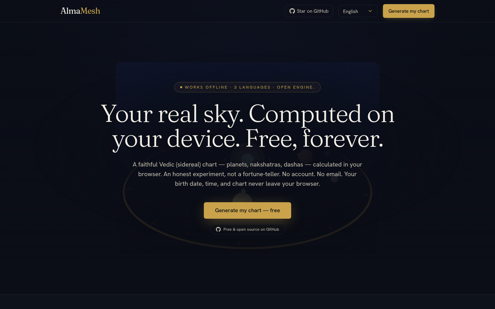

# AlmaMesh

**A free, local-first Vedic astrology app that runs entirely in your browser.**
Give it a birth date, time, and place; it computes a full sidereal (star-based,
not the Western calendar zodiac) chart —
planets, signs, houses, nakshatras, and Vimshottari dasha periods — on your own
device, in a tab. You get **degree-accurate North- and South-Indian kundli
charts** and a **live 3D planetary force-field** of the sky at your birth
moment. **Your chart is pure calculation — no AI touches it by default.** AI
interpretation and chat are strictly opt-in and **bring-your-own**: a one-click
**OpenRouter** preset, or any **OpenAI-compatible endpoint** (including a local
**Ollama**). Your key lives only in this browser, and chart-derived AI prompts
are PII-redacted. No account, no data harvesting. Install it as a
PWA and it works offline after the first load.

**▶ Try it live: [almamesh.com](https://almamesh.com)** — no install, no sign-up.



## Status (verified 2026-07-22)

**The shipped app is local-first by default, signed at the edge, and recoverable.**
The live production identity is whatever
[`almamesh.com/build.json`](https://almamesh.com/build.json) reports — it serves
the deployed commit and build time directly, so this README never has to chase a
SHA (compare it with `git rev-parse main`). At the 2026-07-22 verification the
hosted Test, Deploy, and 11-flow nightly E2E workflows were all green on the
deployed commit.
The live bundle pointer, immutable manifest bytes, SHA-256 hash, and Ed25519
signature were checked against the pinned public key; a fresh browser context
imported a backup and restored both a profile and chart with no console or page
errors.

Verify the live identity yourself:

```bash
curl -fsSL https://almamesh.com/build.json
curl -fsSL https://almamesh.com/version.json
```

The app still has honest boundaries: birthplace lookup is an optional external
request, AI is opt-in and BYO endpoint, and the feedback form is the only production
write path. Chart computation and saved chart data remain local; CSP's `http:`
allowance exists only for a user-configured localhost Ollama endpoint.

- **Why it exists:** astrology apps are riddled with paywalls, account walls, and
  quiet data harvesting. AlmaMesh is the opposite — auditable, gratis, private by
  construction, and the same on every OS because it's just a browser tab. The
  "Observatory" UI ships self-hosted fonts (no font CDN), so a freshly loaded
  app makes **zero cross-origin requests** to draw a chart.
- **Why it's a *mesh*:** the people close to you are part of your sky too. Add
  them as profiles and AlmaMesh reads the **relationship between two whole
  charts** — classical compatibility (Guna Milan) for partners, the planetary
  conversation between any two people, and the times your life-chapters overlap.
  Every relationship is computed on *your* device from two finished charts;
  neither chart is ever changed by the other.
- **Status:** **shipped and tested.** The in-browser engine, the North/South
  charts, the **D9 Navamsa** divisional chart, the 3D force-field, online-primary
  birthplace search with a bundled offline fallback, named profiles (create /
  rename / delete), deterministic (same input, same file every time) **PDF export**, optional AI interpretation + chat, the **mesh** (relationship
  readings between people) and the **Sky & Timing** predictive layer, and
  PWA/offline delivery all work today — see [Status](#status). There is **no
  account or chart-data backend**: Python is a build-time bundle publisher plus
  the engine; the optional feedback form is the isolated server touchpoint.

## Under the hood

- **The engine is real Python, unchanged:** the chart engine is the *unchanged*
  Python `almamesh` package compiled to WebAssembly via **Pyodide** and run in a
  Web Worker. The chart you see in the browser is **byte-identical** to the one
  CPython computes.
- **Why it works offline:** a **signed, content-addressed bundle** (the DE421
  ephemeris + the Skyfield/Pyodide wheels + the `almamesh` wheel + provenance
  metadata) is synced once into OPFS, the browser's private on-disk storage.
  After that, every chart is pure on-device compute — no cloud call is ever
  needed to draw a chart.

## What you get

- **North + South Indian charts** — degree-accurate `SVG` kundli rendered off a
  pure `@almamesh/store` geometry adapter (`buildChartGeometry(SiderealChart)`);
  toggle styles with `ChartStyleToggle`, read placements in the planetary table.
- **3D planetary force-field** — a `three.js` hero (`apps/web/src/components/forcefield/`)
  that places each graha at its real ecliptic longitude from a pure
  `buildEnergyFrame(SiderealChart, t)` adapter, with 2D⇄3D cross-highlighting.
- **AI is off by default — the chart is pure calculation** — nothing leaves your
  device until you opt in. When you do, `@almamesh/llm` talks to any
  **OpenAI-compatible endpoint** you bring: a one-click **OpenRouter** preset for
  stronger models, or a local **Ollama**-style endpoint. Your API key lives only
  in the browser and is never bundled; saving runs a real **connectivity test**
  so a bad key or model is reported immediately, not silently. Chart-derived
  prompts are **PII-redacted**. If you explicitly ask AI to organize a free-form
  life-event narrative, that narrative is sent as written after an in-product
  disclosure; birth details and the chart are not attached. `local_only` is
  **fail-closed** (a cloud host is refused under the privacy gate). AI is **never
  required to draw a chart**.
- **D9 Navamsa divisional chart** — the engine computes the Navamsa (D9) and it
  renders alongside the rasi (D1) in both kundli styles (and in the print report).
  Reshaped by the same pure store adapter; the astrology stays in Python.
- **The mesh — relationship readings between people** — the namesake feature.
  Add the people close to you (each gets a full chart of their own) and open the
  **`/mesh` constellation**; click any thread for a side-by-side read of two
  whole charts. **Partner edges** show the classical 36-point **Ashtakoota Guna
  Milan** and **Mangal (Kuja) dosha** screening (cited tables, fear-free); every
  edge shows the two-way chart overlay, the **daśā windows where both lives
  turn at once**, and the shared house/kāraka significators. The compatibility
  band is labeled a *classical convention, never a verdict*, the AI narration is
  role-anonymized (you and "your spouse", never a name), and the engine's
  read-only promise — relations are read *from* two finished charts and change
  neither — is printed at the foot of every edge.
- **"Sky & Timing" predictive layer** — a second on-device engine pass computes
  current transits (Gochara) + Sade Sati, dasha depth (antar/pratyantar), the full
  D1–D60 divisional-chart set, Ashtakavarga + Shadbala planetary strength, and
  per-life-domain forecasts (career, finances, health, relationships, …). It
  surfaces on the `/predictive` route — including a full **Periods** explorer
  (the 120-year Vimśottarī tree, drillable to antar/pratyantar) and a **Road
  Ahead** timeline — plus a dashboard timing section and report sections VIII–XI,
  same zero-egress, byte-identical determinism as the natal chart.
- **Named profiles** — multiple people share one device with **no passwords**;
  each profile owns its own saved charts, switchable from the header. Profiles
  can be renamed and deleted. Deletion is generation-fenced across tabs and
  cascade-removes that profile's charts, life events, chat, saved readings, and
  derived search vectors without letting a stale tab resurrect them.
- **Birth-time rectification** — set a rectified birth time and a confidence
  level per profile in Settings; the rectified instant recomputes the chart.
- **PDF export** — once a chart exists, the report is available without AI:
  open `/report` directly to export the branded chart, kundli, daśā, predictive,
  strength, and rectification sections. **Deterministic** means what it says: export
  the same chart twice and the two files are byte-for-byte identical, so you can hash
  a report and check later that nobody edited it. The cover date is the chart's own
  calculation time, not the moment you clicked Download. The dashboard shortcut remains tied to a
  completed reading; optional AI-written sections appear only when the stored
  interpretation provenance matches the current chart and predictive cache identity.
  Free-form life histories are normalized into dated, categorized rows so long
  narratives paginate as a readable evidence table instead of a prose blob.
- **Languages (English / Spanish / Portuguese)** — the whole UI is
  internationalized with [react-i18next](https://react.i18next.com/). Switch language in **Settings →
  Preferences → Language**; the choice is persisted and `<html lang>` follows it.
  The **optional AI also answers in the chosen language** (only the narration
  changes — the chart engine and canonical Sanskrit terms stay untouched).
  Catalogs are **bundled and service-worker precached, so it works fully offline
  with zero extra network requests** — no runtime translation fetch. English is
  authoritative; **es/pt are machine-translated** and tracked against it.

## Runtime network and data flow

The chart engine is zero-egress: chart computation remains local and
deterministic. The complete browser network inventory is:

| Trigger | Destination | Data sent | Explicitly not sent |
|---|---|---|---|
| First load, signed engine sync, PWA update | `almamesh.com` | Asset URLs, normal HTTP request metadata | Names, birth data, charts, life events |
| Birthplace search while online | Open-Meteo geocoding | City text you type plus ordinary HTTPS/request metadata visible to the provider | Name, birth date/time, chart; an offline city-list fallback is bundled |
| Optional interpretation or chat | Your configured OpenAI-compatible endpoint | PII-redacted chart facts and, for chat, the question you type | Profile name and birth date |
| Optional life-event organization | Your configured OpenAI-compatible endpoint | The narrative you submit, as written, after the disclosure | Birth details and chart data |
| OpenRouter model list or credit check in Settings | OpenRouter | API request plus the configured key; the credit response concerns that provider account | Chart, birth data, chat, life events |
| Opening feedback when Turnstile is configured | Cloudflare Turnstile | Normal anti-bot request metadata and a challenge token | Chart and birth data |
| Sending feedback | Same-origin `/api/feedback` | Page identifier, thumbs sentiment, optional message as written, Turnstile token | Chart and birth data unless the user puts them in the optional message |

`local_only` fail-closes if a configured AI endpoint is not local. Production
diagnostics emit allowlisted codes only—never raw prompts, narratives, provider
errors, city text, chart data, or profile names.

**The browser enforces that table.** This inventory is not a promise you have to
take on trust: the deployed `Content-Security-Policy` (see
`frontend/apps/web/public/_headers`) restricts `connect-src` to a closed
allowlist—this origin, `openrouter.ai`, `geocoding-api.open-meteo.com`, and
loopback (`localhost` / `127.0.0.1`, any port, for a local model). Any other
destination is refused by the browser itself, so code that tried to send your
data somewhere else could not, even if it wanted to. A consequence worth knowing:
a custom AI endpoint on a **non-loopback** address—a LAN machine like
`http://192.168.1.10:11434`, or a third-party proxy—is blocked by that policy;
use a loopback endpoint or OpenRouter.

## Building from source — prerequisites

**TL;DR: this repo is self-contained — a single `git clone` builds everything.**
The Python side resolves every dependency from PyPI, including
[`edge-proc`](https://pypi.org/project/edge-proc/) — the signed local-data engine.
One dependency is still vendored in-repo, with provenance, license, and re-vendor
policy documented in a `VENDORED.md` next to the code:

- `frontend/packages/edgeproc-browser` — `@edgeproc/browser`, the in-browser
  bundle-sync tier (a regular Bun workspace package)

No sibling checkouts, no private access, no tokens: `git clone`, then
`uv sync` + `bun install`, then run. CI builds from this same single checkout.

## Quickstart — generate a chart in your browser, offline

Requires [Bun](https://bun.sh/), [`uv`](https://docs.astral.sh/uv/), and
Python 3.13. Nothing else — every dependency ships in this repo.

```bash
git clone https://github.com/hseshadr/almamesh.git && cd almamesh

# One command, from the repo root. Installs deps, builds the dev assets, then
# builds and opens the app at http://localhost:4173.
uv run poe demo
```

> The first run fetches the Pyodide dist and the DE421 ephemeris once (network
> required); after that the app is fully offline. Use `uv run poe demo-fresh` to
> force-rebuild the signed dev bundle.

<details>
<summary>What <code>poe demo</code> runs under the hood (the manual steps)</summary>

```bash
# 1. Install workspace deps
cd frontend
bun install

# 2. One-time: build the dev assets the in-browser engine needs.
#    This fetches a self-hosted Pyodide dist and signs a dev edge-proc bundle
#    (DE421 + wheels + meta) into apps/web/public/ — all gitignored.
#    The script lives at frontend/apps/web/scripts/setup-dev-assets.sh.
cd apps/web
./scripts/setup-dev-assets.sh

# 3. Build and preview. IMPORTANT: the engine's module Workers only resolve in a
#    production build, NOT `vite dev` — so build first, then preview.
bun run build
bun run preview            # prints a local URL, e.g. http://localhost:4173
```

</details>

Open the previewed URL, enter a birth date/time/place (birthplace search tries
Open-Meteo first and falls back to the bundled city list), and generate a chart.
After the location is resolved, chart calculation and rendering stay on-device;
the app keeps working with the network disabled.

> **Dev-server caveat:** `bun run dev` (`vite dev`) is fine for editing UI, but
> the dev server's ESM module Workers fail to resolve the `pyodide` import in
> worker scope, so the *engine* only runs in a real build (`vite build` +
> `vite preview`). The live exit-gate test below drives exactly that build.

### No-frontend path: a real chart in one command

Prefer the terminal? The same engine has an offline CLI — no browser, no server.

```bash
cd backend
uv sync --extra dev
uv run almamesh-chart "1990-01-15T12:00:00+00:00" 40.7128 -74.0060
```

It prints the full sidereal chart as JSON — ascendant, the nine grahas with
sign/nakshatra/pada, whole-sign houses, and the active dasha hierarchy — with no
network and no account. (`examples/run_chart.sh` wraps the same call.)

## Publish a signed bundle (build-time)

The engine's data and wheels are delivered to browsers as a **signed,
content-addressed bundle**. A device verifies an ed25519 signature against a
pinned key and **fails closed** on any tampering. Compute always stays local; the
network is delivery-only.

```bash
cd backend
uv run almamesh-bundle keygen ./keys                              # raw ed25519 keypair (0o600 private key)
uv run almamesh-bundle bundle ./origin ./keys/private.key --version v1
```

`./origin` is a static directory any web server or CDN can serve; `public.key` is
pinned into the client as the trust root. (`setup-dev-assets.sh` runs this for you
to produce the local dev bundle.)

One identity note for cold readers: the pinned key is per-environment and never
committed. A local build uses a throwaway **dev** key that `setup-dev-assets.sh`
generates into `frontend/apps/web/public/public.key` (git-ignored), while the
production deploy injects the separate **prod** key from CI secrets — so the live
`https://almamesh.com/public.key` will not match your local copy, by design.
Verify live bundles against the live `/public.key`.

## Architecture

Deeper dives: [docs/ARCHITECTURE.md](docs/ARCHITECTURE.md) (the signed-bundle →
OPFS → Pyodide flow, with the d2 diagram) and
[docs/QUICKSTART.md](docs/QUICKSTART.md) (`make demo` to a rendered chart).

```
Browser (the product) ─ installable PWA, offline after first load
│
├─ frontend/apps/web             React + Vite + Tailwind UI
│    └─ birthplace search        Open-Meteo first, bundled city fallback
│
├─ frontend/packages/browser     the in-browser engine
│    ├─ edge-proc bundle sync ──▶ verifies ed25519 + sha256, materializes into OPFS
│    └─ Pyodide Web Worker  ────▶ boots the UNCHANGED almamesh wheel, computes the chart
│         │  emits SiderealChart (TS mirror of the Python SiderealContext)
│         ▼
├─ frontend/packages/store       pure adapters (reshape only, no astrology):
│    ├─ SiderealChart -> ChartData          (the UI contract)
│    ├─ buildChartGeometry(SiderealChart)   (N/S kundli geometry)
│    ├─ buildEnergyFrame(SiderealChart, t)  (3D force-field frame)
│    ├─ profiles + members                  (named, password-less people; typed relationships)
│    └─ mesh                                (MeshEdgeContext per pair → the /mesh edge view)
├─ frontend/packages/llm         optional interpretation + chat, NO AI by default;
│                                opt-in, BYO OpenAI-compatible endpoint (one-click
│                                OpenRouter preset or a local Ollama); save runs a
│                                connectivity test; chart prompts PII-redacted, fail-closed
│                                local_only; mesh narration is role-anonymized
│                                (no names leave the device)
├─ frontend/packages/shared-types      UI-facing TypeScript contracts
├─ frontend/packages/constants         single design-token source
├─ frontend/packages/memory            local semantic chat memory
└─ frontend/packages/edgeproc-browser  signed-bundle sync and verification

Build-time (Python, no server)
│
└─ backend/src/almamesh
     ├─ calculations.py          sidereal astronomy (Skyfield + DE421; Lahiri default,
     │                           True-Chitra ayanamsa + True-node selectable)
     ├─ dasha/  yogas/           Vimshottari dasha + yoga detection
     ├─ transits/  strength/     predictive: Gochara/Sade Sati, Ashtakavarga + Shadbala, vargas
     ├─ mesh/                    relationship engine: Ashtakoota Guna Milan + Mangal (cited
     │                           classical tables), chart overlay, daśā synchrony, significators
     │                           → a frozen, read-only MeshEdgeContext per pair
     └─ edge/
          ├─ chart_runtime.py    deterministic on-device chart runtime (also runs under Pyodide)
          ├─ bundle.py           signed bundle publisher + consumer
          ├─ cli.py              almamesh-chart   (offline chart, no browser)
          └─ publish_cli.py      almamesh-bundle  (keygen + sign + publish the bundle)
```

The Python entrypoint the browser calls (`calculate_sidereal_context(...,
reference_date=...)`) is the *same* one the CLI calls. The fixed `reference_date`
pins the "current" dasha, which is what makes a chart reproducible byte-for-byte
across CPython and Pyodide.

You can check the sub-arcsecond accuracy claim yourself. It runs **fully
offline**: the engine uses the vendored `backend/de421.bsp`, and the independent
astropy + JPL Horizons oracle values are committed as fixtures (no live download
or API call at test time).

```bash
# Engine longitudes vs an independent astropy oracle (with a committed JPL
# Horizons cross-check), agreeing to sub-arcsecond — natal + transits:
cd backend && uv run pytest tests/validation/test_ground_truth.py tests/test_transit_reference.py -q
```

### Is the browser chart really byte-identical?

Yes, and you can watch it being checked. `verify-browser-parity.mjs` boots the
app in headless Chromium from a served origin, drives the **real** Pyodide Web
Worker, and asserts every fixture in the committed CPython golden comes back
byte-for-byte identical. It runs on every PR and every push to `main`.

```bash
cd frontend && bun install && bash apps/web/scripts/setup-dev-assets.sh && cd apps/web
bunx playwright install chromium                       # one time
VITE_API_URL= VITE_EXIT_GATE_HOOKS=1 ./node_modules/.bin/vite build --outDir dist-verify
VITE_API_URL= ./node_modules/.bin/vite preview --outDir dist-verify --port 4199 --strictPort &
node scripts/verify-browser-parity.mjs http://localhost:4199 \
  --reference-date=2025-01-01T00:00:00+00:00
```

The reference date is an **argument, not a constant baked into the gate**. That
matters: the date pins the "current" dasha, and a gate that hardcodes the one
value it is pinning cannot tell you whether the pin ever reached the engine. So
the gate also runs a *sensitivity control* — the same chart at a different
reference date must produce different bytes. If it doesn't, the gate fails,
because a parity result that ignores its own inputs proves nothing. Pass a
different `--reference-date` yourself and watch the comparison go red.

**What this gate does and does not cover.** It covers the **natal chart**: all
seven fixtures in `backend/tests/fixtures/chart_golden_de421.json`, and it fails
if the golden gains a fixture the gate does not compute. The transit,
predictive, and mesh goldens are enforced **CPython-side** by the backend test
suite; their Pyodide-in-a-browser parity is *not* browser-gated yet. Saying so
here rather than letting the badge imply more than it checks.

See [`frontend/README.md`](frontend/README.md) for the monorepo layout and the
full set of dev/build/test commands.

## Versioning

**v0.4.0 is the application release tag.** Backend and frontend workspace package
versions describe independently versioned implementation layers and need not equal
the app tag.

## Status

| Capability | What | State |
|------------|------|-------|
| Engine | Deterministic sidereal chart + dasha + yogas (Python); Lahiri default, True-Chitra + True-node selectable | ✅ shipped, tested |
| Engine validation | External golden-reference check: astropy (independent code path) + committed JPL Horizons cross-check, agreeing to sub-arcsecond; license-clean (no Swiss Ephemeris) | ✅ shipped, tested |
| Bundle publisher | Signed, content-addressed bundle publish/sync | ✅ shipped, tested |
| Offline CLI | `almamesh-chart`, `almamesh-bundle` | ✅ shipped, tested |
| In-browser engine | The Python wheel in Pyodide/WASM, off the UI thread | ✅ shipped (byte-parity gated in CI, [in a real browser](#is-the-browser-chart-really-byte-identical)) |
| N/S Indian charts | Degree-accurate SVG kundli off a pure geometry adapter | ✅ shipped |
| 3D force-field | three.js hero, planets at real ecliptic longitude | ✅ shipped |
| D9 Navamsa | Engine computes the Navamsa; renders in both kundli styles + the print report | ✅ shipped |
| Divisional charts (D1–D60) | Full Shodasavarga set; D9 also rendered as a kundli, the rest as tables | ✅ shipped |
| Predictive layer ("Sky & Timing") | Transits/Gochara + Sade Sati, dasha depth (antar/pratyantar), Ashtakavarga + Shadbala, per-life-domain forecasts; `/predictive` route (incl. a Periods explorer + Road Ahead) + report sections VIII–XI | ✅ shipped |
| The mesh (relational astrology) | Per-pair relationship read of two whole charts: Ashtakoota Guna Milan + Mangal screening (cited classical tables, partner edges only), chart overlay, daśā synchrony, significators; role-anonymized AI narration, read-only by construction; `/mesh` constellation + `/mesh/:memberId` edge view | ✅ shipped |
| Members | People you add to your mesh, with typed relationships (spouse/partner/family/friend/…), each owning a full chart; persisted with a versioned migration; managed in Settings → People | ✅ shipped |
| AI interpretation + chat | Off by default (pure calculation); opt-in BYO OpenAI-compatible endpoint (one-click OpenRouter preset or a local Ollama); saving runs a connectivity test so a bad key/model is reported immediately; chart prompts are PII-redacted and life-event prose is disclosed separately; fail-closed | ✅ shipped |
| PDF export | Report available after a chart exists (cover + D1/D9 + daśā + predictive sections VIII–XI + Birth Time Authority §XII); AI-written sections require current, provenance-matched interpretation. Byte-reproducible: two exports of one chart are the same file, asserted by SHA-256 in `e2e/report-pdf.e2e.spec.ts` | ✅ shipped |
| Birth-time rectification | Per-profile rectified time + confidence in Settings; recomputes the chart | ✅ shipped |
| Named profiles | Multiple password-less people per device, each owning its charts; rename + delete (chart cascade) | ✅ shipped |
| Birthplace search | Online-primary Open-Meteo lookup with a bundled offline fallback; the city query and ordinary network metadata leave the device, never chart/profile data | ✅ shipped |
| Internationalization | English / Spanish / Portuguese; react-i18next, offline bundled catalogs (zero-egress), persisted language + `<html lang>` sync, AI answers in-language; en authoritative, es/pt machine-translated | ✅ shipped |
| PWA delivery | Service worker + offline reboot + provenance footer | ✅ shipped |

The old SaaS backend (FastAPI, Postgres, Redis, Supabase auth) has been
**removed**. AlmaMesh has no account or chart-data API; only the optional
same-origin feedback function stores the disclosed anonymous feedback record.
See [`CHANGELOG.md`](CHANGELOG.md).

## Development

```bash
# Engine + publisher
cd backend
uv run ruff format . && uv run ruff check . && uv run mypy src/ && uv run pytest -q

# Frontend
cd frontend && bun install
cd frontend && bun run --filter '*' typecheck
cd frontend/apps/web && bun run test:unit                    # Vitest unit suite
cd frontend/apps/web && node scripts/verify-exit-gate.mjs    # live headless-Chromium exit gate (see script header)
cd frontend/apps/web && node scripts/verify-browser-parity.mjs \
  http://localhost:4199 --reference-date=2025-01-01T00:00:00+00:00   # byte-parity gate (real browser)
```

## License

MIT — see [`LICENSE`](LICENSE).
