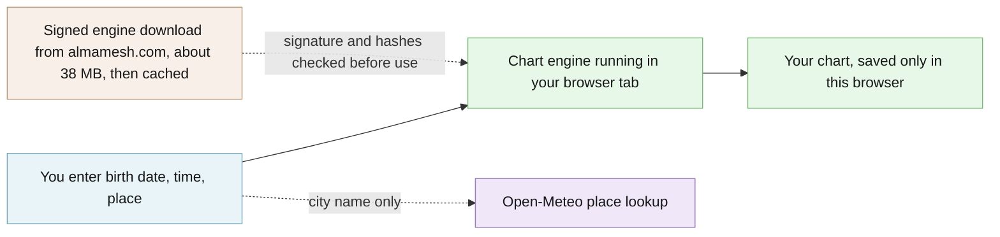

# AlmaMesh

Your Vedic (traditional Indian) astrology chart, free and computed in your own browser — no account, no data harvesting.

[](https://github.com/hseshadr/almamesh/actions/workflows/dagger.yml)
[](CHANGELOG.md)
[](LICENSE)

**[Live demo](https://almamesh.com)** · [Docs](docs/README.md) · [Quickstart](docs/QUICKSTART.md)


<sub>Real output of the example below — the home screen `make demo` opens at http://localhost:4173 (the same app runs at almamesh.com).</sub>

## At a glance

- **What it does** — Like the birth-chart readings on paid astrology sites, but free and calculated on your own device. Enter a birth date, time, and place and it draws your Vedic chart (the Indian tradition, which measures against the fixed stars rather than the Western calendar zodiac): where each planet was, which sign was rising, and the planetary time periods astrologers use for timing. No AI touches your chart unless you switch it on.
- **Who it's for** — Someone curious about Vedic astrology who wants to see their own chart without typing their birth details into a site that demands an email and then sells a "full reading". Also for skeptics who want to check the math themselves, and practitioners who want a careful tool that costs nothing.
- **What stays on your device / what leaves it** — Stays: your name, birth date and time, every chart, and your saved chats. No server holds your birth data or charts, and the chart calculation makes no network calls. Leaves: the city name you type to find your birthplace (sent to Open-Meteo, a free place-lookup service; a built-in city list works offline); and — only if you turn on the optional AI — chart details with your name and birth date removed, the questions you ask, and any life story you explicitly ask it to organize, sent to the AI service you choose. Optional feedback sends a thumbs up or down, the page it is about, and whatever you type. The app tells your browser to refuse connections to any address not on a short fixed list. [Full list of network requests](#runtime-network-and-data-flow).
- **Runs on** — Any modern browser on any operating system; checked in CI on the engines behind Chrome and Safari. Install it from the browser like an app; once the engine has downloaded, it keeps working with no internet. English, Spanish, and Portuguese.
- **Not for** — Certain predictions: it is an honest experiment, not a fortune-teller, and relationship scores are a traditional convention, never a verdict. Also not for syncing through an account — there isn't one; you move your data by exporting a single file and restoring it on another device.
- **Status** — Beta: v0.4.0 (pre-1.0), live at [almamesh.com](https://almamesh.com) and deployed from `main`; changes since v0.4.0 are listed under Unreleased. See [CHANGELOG](CHANGELOG.md).

## Try it in 60 seconds

Fastest: open **[almamesh.com](https://almamesh.com)** — nothing to install, no sign-up.

To run your own copy (needs [uv](https://docs.astral.sh/uv/) and [Bun](https://bun.sh/)):

```bash
git clone https://github.com/hseshadr/almamesh.git && cd almamesh && make demo
```

The first run takes longer than a minute: it installs packages, downloads the
in-browser Python engine and the planet-position tables once, signs a local
copy of them with a throwaway key, and builds the app. Then:

1. Your browser opens http://localhost:4173 — the home screen above.
2. Click **Generate my chart — free**, enter any name and birth date and time, and search for a city.
3. Click **Generate**. First time only, the engine (about 38 MB) downloads and is saved in your browser.
4. Your full chart appears on the dashboard, computed in your tab. Disconnect from the internet and it still works.

<details>
<summary>No browser? Get the same chart as data in your terminal</summary>

```bash
cd backend && uv sync --extra dev
uv run almamesh-chart "1990-01-15T12:00:00+00:00" 40.7128 -74.0060   # New York, 15 Jan 1990, 12:00 UTC
```

Excerpt of the real output. `lagna` is the rising sign; a `nakshatra` is one of
the 27 star groups the Moon passes through, split into four `pada` quarters:

```text
{
  "ayanamsa_value": 23.7174,
  "lagna": {
    "longitude": 264.9083218673543,
    "sign": "Sagittarius",
    "sign_degrees": 24.90832186735429,
    "sign_lord": "jupiter",
    "nakshatra": "Purva Ashadha",
    "nakshatra_pada": 4,
```

The full JSON (about 47 KB) also lists every planet, the houses, and the time
periods. It runs with no network and no account. Everything above depends only
on the three arguments. The `current_maha`, `current_antar`, and
`current_pratyantar` fields do not: this CLI has no reference-date option, so
they show the periods running on the day you run it.
</details>

More runnable examples: [`examples/`](examples/).

<!-- ======================== BELOW THE FOLD ======================== -->

## How it works

The first time you generate a chart, your browser downloads a signed engine
bundle (the real Python chart engine, its planet-position tables, and the
packages it needs) and checks its signature and every file's hash before using
it. The engine then runs inside your browser tab, in a background worker, using
Pyodide (Python compiled to WebAssembly). Your birth details go straight from
the form to that engine; the finished chart is saved in a database inside your
browser. The only lookup that leaves the device during chart creation is the
city name, and only while you search for your birthplace.


```mermaid
flowchart LR
    A["You enter birth date, time, place"] --> B["Chart engine running in your browser tab"]
    B --> C["Your chart, saved only in this browser"]
    D["Signed engine download from almamesh.com, about 38 MB, then cached"] -.->|signature and hashes checked before use| B
    A -.->|city name only| E["Open-Meteo place lookup"]

    classDef blue fill:#e8f4f8,stroke:#7aa7b8,color:#171717
    classDef green fill:#e8f8e8,stroke:#7ab87a,color:#171717
    classDef orange fill:#f8f0e8,stroke:#b8987a,color:#171717
    classDef purple fill:#f0e8f8,stroke:#9a7ab8,color:#171717
    class A blue
    class B,C green
    class D orange
    class E purple
```

**[Explore the interactive architecture map →](docs/architecture/index.html)**
(Archify, generated from [`docs/architecture/runtime.architecture.json`](docs/architecture/runtime.architecture.json)).
Deep dive: [docs/ARCHITECTURE.md](docs/ARCHITECTURE.md).

Most astrology apps ask you to trust a server with personal birth data. AlmaMesh
does not have a chart-data server. The browser downloads a signed engine once,
verifies it, and computes charts locally in a Web Worker.

**The engine reads no clock** when the app calls it. A chart is a pure function of four recorded
inputs — birth instant, latitude, longitude, and the *reference instant* that
selects the current Vimshottari period. The app stores that fourth input with the
chart, so the same inputs produce the same bytes on CPython and in the browser.
(The terminal CLI above is the exception: it passes no reference instant, so the
engine falls back to today's date for the "current period" fields.)

## Architecture (code map)

```
Browser (the product) ─ installable PWA, offline after first load
│
├─ frontend/apps/web             React + Vite + Tailwind UI
│    └─ birthplace search        Open-Meteo first, bundled city fallback
│
├─ frontend/packages/browser     the in-browser engine
│    ├─ edge-proc bundle sync ──▶ verifies ed25519 + sha256
│    │                              OPFS primary; IndexedDB fallback + shared rollback floor
│    └─ Pyodide Web Worker  ────▶ boots the UNCHANGED almamesh wheel, computes the chart
│         │  emits SiderealChart (TS mirror of the Python SiderealContext)
│         ▼
├─ frontend/packages/store       pure adapters (reshape only, no astrology):
│    ├─ SiderealChart -> ChartData          (the UI contract)
│    ├─ buildChartGeometry(SiderealChart)   (N/S kundli geometry)
│    ├─ buildEnergyFrame(SiderealChart, t)  (3D force-field frame)
│    ├─ profiles + members                  (named, password-less people; typed relationships)
│    ├─ portable SQLite state               canonical user data in one OPFS database;
│    │                                           legacy IndexedDB migrates once, API keys stay out
│    └─ mesh                                (MeshEdgeContext per pair → the /mesh edge view)
├─ frontend/packages/llm         optional interpretation + chat, NO AI by default;
│                                opt-in, BYO OpenAI-compatible endpoint (one-click
│                                OpenRouter preset or a local Ollama); save runs a
│                                connectivity test; chart prompts PII-redacted, fail-closed
│                                local_only; mesh narration is role-anonymized
│                                (no names leave the device)
├─ frontend/packages/shared-types      UI-facing TypeScript contracts
├─ frontend/packages/constants         single design-token source
├─ frontend/packages/memory            local semantic chat memory:
│    ├─ MiniLM Web Worker              self-hosted, on-device embeddings
│    └─ SQLite vector Worker           sqlite-vector exact search; OPFS persistence

External Lego: @edgeproc/browser       signed-bundle sync plus SQLite/vector browser substrate

Build-time (Python, no server)
│
└─ backend/src/almamesh
     ├─ calculations.py          sidereal astronomy (Skyfield + DE421; Lahiri default,
     │                           True-Chitra ayanamsa + True-node selectable)
     ├─ dasha/  yogas/           Vimshottari dasha + yoga detection
     ├─ transits/  strength/     predictive: Gochara/Sade Sati, Ashtakavarga + Shadbala, vargas
     ├─ mesh/                    relationship engine: Ashtakoota Guna Milan + Mangal (cited
     │                           classical tables), chart overlay, daśā synchrony, significators
     │                           → a frozen, read-only MeshEdgeContext per pair
     └─ edge/
          ├─ chart_runtime.py    deterministic on-device chart runtime (also runs under Pyodide)
          ├─ bundle.py           signed bundle publisher + consumer
          ├─ cli.py              almamesh-chart   (offline chart, no browser)
          └─ publish_cli.py      almamesh-bundle  (keygen + sign + publish the bundle)
```

The Python entrypoint the browser calls (`calculate_sidereal_context(...,
reference_date=...)`) is the *same* one the CLI calls. The fixed `reference_date`
pins the "current" dasha, which is what makes a chart reproducible byte-for-byte
across CPython and Pyodide.

See [`frontend/README.md`](frontend/README.md) for the monorepo layout and the
full set of dev/build/test commands.

## What you can do

- Draw degree-accurate North- and South-Indian charts, D1–D60 divisional charts,
  Vimshottari periods, transits, Shadbala, Ashtakavarga, and life-domain timing —
  [architecture](docs/ARCHITECTURE.md).
- Keep multiple local profiles and read the relationship between two finished
  charts — [capability table](#limitations--roadmap).
- Rectify an uncertain birth time from dated life events. The accepted time becomes the
  chart authority; rejected candidates never feed transit houses or the report —
  [spec](docs/specs/059-event-based-rectification.md).
- Download a PDF report. The report is available without AI: export the same chart twice and the two files are byte-for-byte identical. Long life histories become dated,
  categorized table rows with bounded text and controlled page breaks —
  [spec](docs/specs/062-robust-rectifier-comprehensive-report.md).
- Use it in English, Spanish, or Portuguese, bundled for offline use.
- Keep everything in one portable, on-device SQLite database: canonical profiles,
  charts, life events, chat, interpretations, and language. Settings can export the real
  database file and restore it on another device; provider API keys and
  rebuildable caches are deliberately excluded —
  [spec](docs/specs/061-backup-restore-your-data.md).
- Optionally turn on AI interpretation and chat. AI is off by default. If you enable it,
  requests go directly from your browser to the endpoint you configure. Asking
  AI to organize free-form life events sends that narrative as written only
  after the in-product disclosure — [network table](#runtime-network-and-data-flow).

## Why this and not X

| Option | Better choice when | Where AlmaMesh differs |
|---|---|---|
| Paid astrology sites and apps | You want a human-written or curated reading, or an astrologer to talk to | Free, no account or email, and the birth data never reaches a server |
| Free online chart calculators | You only need a quick one-off chart and don't mind the site seeing your birth data | The calculation runs in your tab; charts are saved locally and work offline |
| Desktop astrology software (for example, Jagannatha Hora on Windows) | You are a practitioner who needs far more techniques and settings than AlmaMesh offers | Runs in any browser on any OS; the engine is open source and checked against an independent astronomy reference |
| Do nothing / ask a family astrologer | You trust a person more than software | AlmaMesh shows its math and states what it cannot prove |

## Runtime network and data flow

The chart engine is zero-egress: chart computation stays on your device, and it
is deterministic in the sense above — same four recorded inputs, same bytes. The
complete browser network inventory is:

| Trigger | Destination | Data sent | Explicitly not sent |
|---|---|---|---|
| First load, signed engine sync, PWA update | `almamesh.com` | Asset URLs, normal HTTP request metadata | Names, birth data, charts, life events |
| Birthplace search while online | Open-Meteo geocoding | City text you type plus ordinary HTTPS/request metadata visible to the provider | Name, birth date/time, chart; an offline city-list fallback is bundled |
| Optional interpretation or chat | Your configured OpenAI-compatible endpoint | PII-redacted chart facts and, for chat, the question you type | Profile name and birth date |
| Optional life-event organization | Your configured OpenAI-compatible endpoint | The narrative you submit, as written, after the disclosure | Birth details and chart data |
| OpenRouter model list or credit check in Settings | OpenRouter | API request plus the configured key; the credit response concerns that provider account | Chart, birth data, chat, life events |
| Opening feedback when Turnstile is configured | Cloudflare Turnstile | Normal anti-bot request metadata and a challenge token | Chart and birth data |
| Sending feedback | Same-origin `/api/feedback` | Page identifier, thumbs sentiment, optional message as written, Turnstile token | Chart and birth data unless the user puts them in the optional message |

`local_only` fail-closes if a configured AI endpoint is not local. Production
diagnostics emit allowlisted codes only—never raw prompts, narratives, provider
errors, city text, chart data, or profile names.

**The browser enforces that table.** This inventory is not a promise you have to
take on trust: the deployed `Content-Security-Policy` (see
`frontend/apps/web/public/_headers`) restricts `connect-src` to a closed
allowlist—this origin, `openrouter.ai`, `geocoding-api.open-meteo.com`, and
loopback (`localhost` / `127.0.0.1`, any port, for a local model). Any other
destination is refused by the browser itself, so code that tried to send your
data somewhere else could not, even if it wanted to. A consequence worth knowing:
a custom AI endpoint on a **non-loopback** address—a LAN machine like
`http://192.168.1.10:11434`, or a third-party proxy—is blocked by that policy;
use a loopback endpoint or OpenRouter.

## Security and trust model

- **Verified:** every engine bundle the browser syncs — the signed `latest`
  pointer is checked against the ed25519 release key (`public.key`, served from
  the same origin), and the manifest and every content-addressed chunk against
  their SHA-256 hashes. Production bundles carry a signed, increasing sequence
  number, so an older genuinely-signed bundle cannot be replayed over a newer one.
- **Refuses rather than warns:** a bad signature, a hash mismatch, or a rollback
  to an older sequence stops the engine from booting from that bundle; the app
  offers in-app recovery ("Reset & reload") instead of running unverified code.
  `local_only` refuses a non-local AI endpoint. The engine refuses out-of-range
  coordinates instead of silently computing a wrong chart. The browser refuses
  network destinations outside the allowlist above.
- **Not protected:** a compromised device, browser, or browser extension; a
  compromised `almamesh.com` origin (the verification key is delivered from that
  same origin); what the AI provider you opt into, or Open-Meteo, does with what
  you send it. Data inside the browser is not encrypted by AlmaMesh — anyone with
  access to your browser profile can read it (exports can be password-protected).
- **Verify a release:** build and sign it yourself (`make demo` signs a local
  bundle with a throwaway key), run the accuracy and parity checks in
  [What this proves](#what-this-proves--what-it-does-not-prove), and compare
  deployed bundles against the live `https://almamesh.com/public.key` — see
  [Publish a signed bundle](#publish-a-signed-bundle-build-time) for why a local
  key never matches the production key.

See [SECURITY.md](SECURITY.md) for reporting a vulnerability.

## What this proves / what it does not prove

**Planet positions are accurate to under an arcsecond.** You can check this yourself. It runs **fully
offline**: the engine uses the vendored `backend/de421.bsp`, and the independent
astropy + JPL Horizons oracle values are committed as fixtures (no live download
or API call at test time).

```bash
# Engine longitudes vs an independent astropy oracle (with a committed JPL
# Horizons cross-check), agreeing to sub-arcsecond — natal + transits:
cd backend && uv run pytest tests/validation/test_ground_truth.py tests/test_transit_reference.py -q
```

### Is the browser chart really byte-identical?

Yes, and you can watch it being checked. `verify-browser-parity.mjs` boots the
app in headless Chromium from a served origin, drives the **real** Pyodide Web
Worker, and asserts every fixture in the committed CPython golden comes back
byte-for-byte identical. It runs on every PR and every push to `main`.

```bash
cd frontend && bun install && bash apps/web/scripts/setup-dev-assets.sh && cd apps/web
bunx playwright install chromium                       # one time
VITE_API_URL= VITE_EXIT_GATE_HOOKS=1 ./node_modules/.bin/vite build --outDir dist-verify
VITE_API_URL= ./node_modules/.bin/vite preview --outDir dist-verify --port 4199 --strictPort &
node scripts/verify-browser-parity.mjs http://localhost:4199 \
  --reference-date=2025-01-01T00:00:00+00:00
```

The reference date is an **argument, not a constant baked into the gate**. That
matters: the date pins the "current" dasha, and a gate that hardcodes the one
value it is pinning cannot tell you whether the pin ever reached the engine. So
the gate also runs a *sensitivity control* — the same chart at a different
reference date must produce different bytes. If it doesn't, the gate fails,
because a parity result that ignores its own inputs proves nothing. Pass a
different `--reference-date` yourself and watch the comparison go red.

**The PDF report is reproducible:** two exports of one chart are the same file,
asserted by SHA-256 in `e2e/report-pdf.e2e.spec.ts`.

**What this does not prove.**

- The browser parity gate covers the **natal chart**: all seven fixtures in
  `backend/tests/fixtures/chart_golden_de421.json`, and it fails if the golden
  gains a fixture the gate does not compute. The transit, predictive, and mesh
  goldens are enforced **CPython-side** by the backend test suite; their
  Pyodide-in-a-browser parity is *not* browser-gated yet. Saying so here rather
  than letting the badge imply more than it checks.
- Accurate planet positions say nothing about whether astrology predicts
  anything. Strength percentages are calibrated structural measures, not
  empirically validated life outcomes; rectification confidence is a
  best-versus-runner-up fit margin, never the probability that a birth time is
  correct.
- The terminal CLI output is reproducible only in the fields that do not depend
  on today's date (see [Try it in 60 seconds](#try-it-in-60-seconds)).

## Install

**TL;DR: one clone and the locked package installs build everything.** The
Python side resolves [`edge-proc`](https://pypi.org/project/edge-proc/) from
PyPI. The browser consumes the public
[`@edgeproc/browser`](https://github.com/hseshadr/edgeproc-browser) Lego at an
exact Git commit recorded in `frontend/packages/browser/package.json` and
`frontend/bun.lock`; no copied sync/storage implementation remains here. See
[`docs/edgeproc-browser.md`](docs/edgeproc-browser.md) for provenance and the
consumer boundary.

No sibling checkout, private access, or token is required: `git clone`, then
`uv sync` + `bun install`, then run. CI uses the same frozen locks.

Hosted: nothing to install — use [almamesh.com](https://almamesh.com), and
install it from the browser as an app if you want it offline.

From source: requires [Bun](https://bun.sh/) (version pinned in
`frontend/.bun-version`), [`uv`](https://docs.astral.sh/uv/), and Python 3.13.
Everything else resolves from public sources through committed locks and exact pins.

```bash
git clone https://github.com/hseshadr/almamesh.git && cd almamesh

# One command, from the repo root. Installs deps, builds the dev assets, then
# builds and opens the app at http://localhost:4173.
uv run poe demo            # same as `make demo`
```

> The first run fetches the Pyodide dist and the DE421 ephemeris once (network
> required); after that the app is fully offline. Use `uv run poe demo-fresh` to
> force-rebuild the signed dev bundle.

<details>
<summary>What <code>poe demo</code> runs under the hood (the manual steps)</summary>

```bash
# 1. Install workspace deps
cd frontend
bun install

# 2. One-time: build the dev assets the in-browser engine needs.
#    This fetches a self-hosted Pyodide dist and signs a dev edge-proc bundle
#    (DE421 + wheels + meta) into apps/web/public/ — all gitignored.
#    The script lives at frontend/apps/web/scripts/setup-dev-assets.sh.
cd apps/web
./scripts/setup-dev-assets.sh

# 3. Build and preview. IMPORTANT: the engine's module Workers only resolve in a
#    production build, NOT `vite dev` — so build first, then preview.
bun run build
bun run preview            # prints a local URL, e.g. http://localhost:4173
```

</details>

Open the previewed URL, enter a birth date/time/place (birthplace search tries
Open-Meteo first and falls back to the bundled city list), and generate a chart.
After the location is resolved, chart calculation and rendering stay on-device;
the app keeps working with the network disabled.

> **Dev-server caveat:** `bun run dev` (`vite dev`) is fine for editing UI, but
> the dev server's ESM module Workers fail to resolve the `pyodide` import in
> worker scope, so the *engine* only runs in a real build (`vite build` +
> `vite preview`). The browser parity gate above drives exactly that build.

## Usage & API

**In the browser:** onboard with a name, birth date/time, and city; the
dashboard then shows the chart, periods, and timing. Profiles, people you add
to your mesh, AI settings, language, and backup/restore live in Settings.

**Terminal chart (`almamesh-chart`):** the same engine as an offline CLI — no
browser, no server.

```bash
cd backend
uv sync --extra dev
uv run almamesh-chart "1990-01-15T12:00:00+00:00" 40.7128 -74.0060
```

It prints the full sidereal chart as JSON — ascendant, the nine grahas with
sign/nakshatra/pada, whole-sign houses, and the dasha hierarchy — with no
network and no account. (`examples/run_chart.sh` wraps the same call.)

### Publish a signed bundle (build-time)

The engine's data and wheels are delivered to browsers as a **signed,
content-addressed bundle**. A device verifies its ed25519 signature against the
same-origin release key and **fails closed** on any mismatch. The service worker
keeps a release-matched offline copy, while online loads revalidate the key so a
key and its newly signed bundle can rotate together. Compute always stays local;
the network is delivery-only.

```bash
cd backend
uv run almamesh-bundle keygen ./keys                              # raw ed25519 keypair (0o600 private key)
uv run almamesh-bundle bundle ./origin ./keys/private.key --version v1
```

`./origin` is a static directory any web server or CDN can serve; `public.key` is
the release verification key delivered from that same origin. (`setup-dev-assets.sh`
runs this for you to produce the local dev bundle.)

One identity note for cold readers: the signing key is per-environment and never
committed. A local build uses a throwaway **dev** key that `setup-dev-assets.sh`
generates into `frontend/apps/web/public/public.key` (git-ignored), while the
production deploy injects the separate **prod** key from CI secrets — so the live
`https://almamesh.com/public.key` will not match your local copy, by design.
Verify live bundles against the live `/public.key`.

## Configuration

Nothing needs configuring to draw a chart. The knobs that exist:

- **In the app (Settings):** AI provider (off by default; OpenRouter preset or any
  OpenAI-compatible loopback endpoint), model, and `local_only` mode; language;
  profiles and people; backup and restore. Your AI key is stored only in this
  browser and is excluded from backups.
- **Build-time (`VITE_` env vars for the web app):** `VITE_BUNDLE_BASE_URL`
  (overrides where the signed bundle is synced from; default is this origin),
  `VITE_TURNSTILE_SITE_KEY` (enables the feedback anti-bot check), and the
  `VITE_LLM_*` defaults for the optional AI provider. `VITE_EXIT_GATE_HOOKS=1`
  is for test builds only.
- **Dev assets:** `PYODIDE_VERSION`, `PYODIDE_DIST` (use a local Pyodide dist
  instead of downloading), and `DEV_BUNDLE_SEQUENCE` for
  `frontend/apps/web/scripts/setup-dev-assets.sh`.
- **Engine (`backend`, pydantic-settings, reads `.env`):** `EPHEMERIS_FILE`
  (default `de421.bsp`, the ephemeris the publisher ships).

Signing keys are never committed: `private.key` files are git-ignored, and the
production key comes from CI secrets. Don't bake a real `VITE_LLM_API_KEY` into a
build you publish — build-time values end up in the shipped JavaScript.

## Limitations & roadmap

**Shipped** (in v0.4.0 or listed under Unreleased in the [CHANGELOG](CHANGELOG.md)):

| Capability | What | State |
|------------|------|-------|
| Engine | Deterministic sidereal chart + dasha + yogas (Python); Lahiri default, True-Chitra + True-node selectable | ✅ shipped, tested |
| Engine validation | External golden-reference check: astropy (independent code path) + committed JPL Horizons cross-check, agreeing to sub-arcsecond; license-clean (no Swiss Ephemeris) | ✅ shipped, tested |
| Bundle publisher | Signed, content-addressed bundle publish/sync | ✅ shipped, tested |
| Offline CLI | `almamesh-chart`, `almamesh-bundle` | ✅ shipped, tested |
| In-browser engine | The Python wheel in Pyodide/WASM, off the UI thread | ✅ shipped (byte-parity gated in CI, [in a real browser](#is-the-browser-chart-really-byte-identical)) |
| N/S Indian charts | Degree-accurate SVG kundli off a pure geometry adapter | ✅ shipped |
| 3D force-field | three.js hero, planets at real ecliptic longitude | ✅ shipped |
| D9 Navamsa | Engine computes the Navamsa; renders in both kundli styles + the print report | ✅ shipped |
| Divisional charts (D1–D60) | Full Shodasavarga set; D9 also rendered as a kundli, the rest as tables | ✅ shipped |
| Predictive layer ("Sky & Timing") | Transits/Gochara + Sade Sati, dasha depth (antar/pratyantar), Ashtakavarga + Shadbala, per-life-domain forecasts; `/predictive` route (incl. a Periods explorer + Road Ahead) + report sections VIII–XI | ✅ shipped |
| The mesh (relational astrology) | Per-pair relationship read of two whole charts: Ashtakoota Guna Milan + Mangal screening (cited classical tables, partner edges only), chart overlay, daśā synchrony, significators; role-anonymized AI narration, read-only by construction; `/mesh` constellation + `/mesh/:memberId` edge view | ✅ shipped |
| Members | People you add to your mesh, with typed relationships (spouse/partner/family/friend/…), each owning a full chart; persisted with a versioned migration; managed in Settings → People | ✅ shipped |
| AI interpretation + chat | Off by default (pure calculation); opt-in BYO OpenAI-compatible endpoint (one-click OpenRouter preset or a local Ollama). Natal reading and current timeline are separate, explicit actions with independent progress and storage; mount/reload/day rollover spend no tokens. Prompts are PII-redacted and life-event prose is disclosed separately; fail-closed | ✅ shipped |
| PDF export | Report available after a chart exists (cover + D1/D9 + daśā + deterministic predictive sections VIII–XI + Birth Time Authority §XII); stable natal AI prose is optional. Date-sensitive AI timeline prose stays on the dashboard, where its generated/as-of date remains visible. Byte-reproducible: two exports of one chart are the same file, asserted by SHA-256 in `e2e/report-pdf.e2e.spec.ts` | ✅ shipped |
| Birth-time rectification | Per-profile rectified time + confidence in Settings; recomputes the chart | ✅ shipped |
| Named profiles | Multiple password-less people per device, each owning its charts; rename + delete (chart cascade) | ✅ shipped |
| Birthplace search | Online-primary Open-Meteo lookup with a bundled offline fallback; the city query and ordinary network metadata leave the device, never chart/profile data | ✅ shipped |
| Internationalization | English / Spanish / Portuguese; react-i18next, offline bundled catalogs (zero-egress), persisted language + `<html lang>` sync, AI answers in-language; en authoritative, es/pt machine-translated | ✅ shipped |
| PWA delivery | Service worker + offline reboot + provenance footer | ✅ shipped |

The old SaaS backend (FastAPI, Postgres, Redis, Supabase auth) has been
**removed**. AlmaMesh has no account or chart-data API; only the optional
same-origin feedback function stores the disclosed anonymous feedback record.

**Planned (not shipped):**

- Browser (Pyodide) parity gates for the transit, predictive, and mesh outputs;
  today only the natal chart is browser-gated.
- A reference-date option for the `almamesh-chart` CLI.
- Exact dual-lagna production wiring and PDF stability markers
  ([rigor spec](docs/rigor-upgrade-spec.md), Stage 4 is partial).
- Custom AI endpoints on non-loopback addresses are blocked by the browser
  policy; there is no supported way to use one today.

**Versioning:** v0.4.0 is the application release tag. Backend and frontend
workspace package versions describe independently versioned implementation
layers and need not equal the app tag.

## Getting help

- **GitHub Issues** — Best for: bugs and concrete feature requests.
- **In-app feedback** — Best for: quick thumbs up/down on a screen (see the network table for what it sends).
- **Email (private)** — Best for: security reports; see [SECURITY.md](SECURITY.md).

## Contributing / development

```bash
make gate
```

That runs backend `uv run poe gate` (ruff, mypy, xenon, pytest with coverage)
and frontend `bun run gate` (typecheck, lint, unit tests, build) — the same two
commands CI runs. The required native Dagger checks also generate the signed
browser assets and drive real onboarding, parity, offline, privacy/reset,
Chromium/WebKit, and report-PDF journeys; run them locally with `dagger check`.

See [CONTRIBUTING.md](CONTRIBUTING.md).

## License / Citation

MIT — see [LICENSE](LICENSE).
