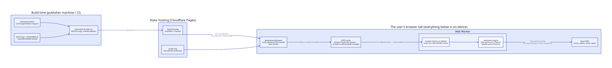

# Architecture

**TL;DR:** AlmaMesh is a Vedic astrology app with **no server**. The Python
chart engine — the same `almamesh` package you can run on your laptop — runs
*inside the browser tab* under Pyodide (Python compiled to WebAssembly), fed by
an ed25519-signed, content-addressed bundle cached in durable browser storage.
OPFS is the fast path; IndexedDB is the persistent fallback when a browser
exposes OPFS but cannot open it. The network carries
delivery metadata and the explicitly disclosed city-search/optional-AI flows;
birth details and computed charts are not sent by the engine or geocoder.

This page is the orientation map. The deep, always-current reference is
[CLAUDE.md](../CLAUDE.md) (tech stack, package table, data contract, quality
gates); the [README](../README.md) carries the product story. Per the portfolio
standard, this repo is the exemplar for the "Pyodide app engine" pattern
(ENGINEERING-STANDARDS §8.1a).

## The delivery + compute flow

The diagram shows the primary OPFS path. IndexedDB implements the same cache
contract when OPFS cannot open and always retains the shared monotonic release
floor, so switching storage backends cannot accept an older signed bundle. That
small IndexedDB control plane is required even on the OPFS fast path; serialized
reads and syncs ensure pruning cannot invalidate an in-flight reader. Successful
syncs prune its content to the active release when Web Locks are available;
otherwise pruning is skipped. Quota failures keep serving the last authenticated
complete release.

*Diagram source: [assets/delivery-flow.d2](assets/delivery-flow.d2) (d2, the
house diagram format).*

1. **Build time** — `almamesh-bundle` (the Python CLI in `backend/`) assembles
   the engine wheel, the JPL DE421 ephemeris, and the Pyodide/Skyfield wheels
   into a content-addressed bundle and signs it with an ed25519 key. The
   private key never enters the repo (CI tree-guard enforces it); the release
   verification key ships from the same origin as `/public.key`, with a
   hash-versioned service-worker fallback for offline boots.
2. **Delivery** — the bundle is static files on Cloudflare Pages. One-way:
   nothing ever flows back.
3. **In the tab** — `@almamesh/browser` verifies the signature (fail-closed:
   a bad signature raises, never downgrades), syncs chunks into a private,
   durable content-addressed cache (**OPFS**, or **IndexedDB** when OPFS cannot
   open), and boots the **unchanged wheel** under
   Pyodide in a Web Worker. Charts compute off the UI thread, byte-identical
   to CPython — `apps/web/scripts/verify-browser-parity.mjs` enforces that
   identity in CI by driving the real Worker in headless Chromium and
   byte-comparing every natal fixture against the committed CPython golden.
   (Transit, predictive, and mesh goldens are enforced CPython-side by the
   backend suite; their Pyodide parity is not yet browser-gated.)
4. **UI** — React reshapes `SiderealChart → ChartData` and renders. TypeScript
   never computes astrology (house rule #2).

## Where things live

| Area | Path | Notes |
|---|---|---|
| Python engine + bundle publisher | `backend/src/almamesh/` | Pydantic models, Skyfield astronomy, dasha/yoga/mesh/rectification engines |
| Signed-bundle delivery core | `edge-proc` (PyPI) | pinned `>=0.3.0` in `backend/pyproject.toml` — the first release whose anti-replay guard fails closed |
| Browser engine + PWA | `frontend/` (Bun workspace) | packages table in [CLAUDE.md](../CLAUDE.md#frontend-monorepo-packages-frontendpackages) |
| Specs (numbered) | `docs/specs/` | feature design records |
| CI/CD + deploy | `dagger/src/index.ts` → Cloudflare Pages | typed secrets, key custody, and exact live identity; GitHub workflows are pinned ingress only |

## Load-bearing invariants

- **Determinism:** same inputs → byte-identical chart on CPython and Pyodide.
  The inputs are `(datetimeUtc, latitude, longitude, referenceDate)` — all four,
  including the reference instant that pins the "current" Vimshottari daśā. The
  engine reads no clock: `BirthInput.referenceDate` is REQUIRED and the shipped
  glue raises rather than substituting `now()`
  (`chartWorker.ts` `_almamesh_generate_chart`). The app mints that instant once
  per generation in `packages/store/src/chartReferenceInstant.ts` and stores it
  as the chart's `calculation_timestamp`, so the printed generation date is the
  key that reproduces the chart. Guarded by
  `backend/tests/test_chart_worker_glue.py`, which runs the SHIPPED glue —
  extracted from the TypeScript, not re-implemented — against the CPython golden.
- **Zero egress on the chart path;** exactly two disclosed opt-in egresses
  (cloud AI, birthplace geocoding) — see the data-contract section of
  [CLAUDE.md](../CLAUDE.md#data-contract-no-api-its-a-transform--signed-bundle).
- **Client-side data is sacred:** storage formats, cache names, and the bundle
  verify key are compatibility surfaces for real users — never change them
  casually.
